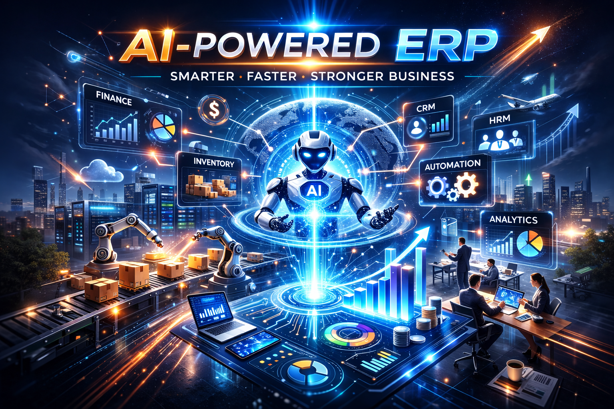
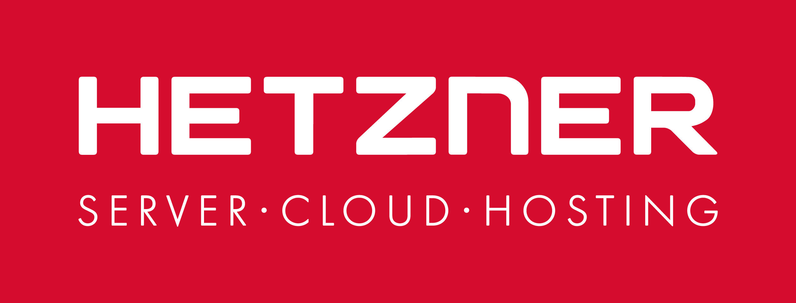

  

<h1 align="center">LiteERP</h1>

  Lightweight Open-Source ERP for internal business operations.

---

  

---

## DEMO 

<a href="http://liteerp.org/" target="_blank">Demo</a>

---

## 🎯 Who Is LiteERP Built For?

LiteERP is designed for **small and medium-sized businesses (SMEs)** that need a **clean, operational ERP core** without enterprise-level complexity.

Typical use cases include:
- Retail stores and retail chains
- Wholesale distributors
- Trading companies
- Import / export businesses
- SMEs managing inventory, orders, pricing, and customers

LiteERP focuses on **day-to-day internal operations**, such as:
- Product & inventory management
- Purchase & sales workflows
- Pricing rules and discounts
- Customer & supplier management

Industry-specific requirements — such as reporting, analytics, tax rules,
accounting integration, custom pricing logic, or workflow automation —
are intentionally handled through **Extensions**, not hardcoded into the core.

---

## 🏢 LiteERP – A Pure Core ERP, Built for Extension, Not Complexity

LiteERP is an open-source ERP built with **Laravel**, **ReactJS**, and **MySQL 8**,  
designed as a **pure, minimal core** with an **extension-first architecture**.

LiteERP is **not trying to replace SAP or Odoo**.  
Those platforms are powerful and suitable for large enterprises or broad use cases.

LiteERP follows a different philosophy:

> **Keep the core small, stable, and predictable —  
> push complexity outward into extensions.**

The system is built on:
- Clean Architecture
- Domain-Driven Design (DDD)
- Domain Events
- Very low framework coupling

---

## ⚖️ LiteERP vs Odoo vs SAP

| Aspect | LiteERP | Odoo | SAP |
|------|--------|------|-----|
| Core size | **Small & pure** | Large, feature-heavy | Very large |
| Customization | Extensions & hooks | Core overrides & modules | Consultants & customization layers |
| Infrastructure | **Low-resource friendly** | Medium–High | High–Very High |
| Upgrade safety | **High** | Medium | Low–Medium |
| Target users | SMEs & developers | SMEs–Enterprises | Large enterprises |

---

## 📘 LiteERP – Business Logic & Operational Principles

Please consider here: <a href="./docs/business.md">Read more</a>

---

## 🧠 A Pure and Minimal Core

The LiteERP core intentionally focuses only on:
- Essential operational workflows
- Clear and predictable business rules
- Strong domain boundaries
- Authentication & authorization
- Multi-business context
- Extension loading mechanism

Instead of absorbing complexity,  
LiteERP treats **complexity as an external concern** handled by extensions.

---

## 🧩 Extensions – Where Real Power Lives

All domain-specific and evolving business logic lives in **Extensions**.

Extensions are:
- Fully decoupled from the core
- Loaded only when needed
- Able to hook into domain events, validation, workflows, and APIs
- Safe to develop, replace, or remove without touching core logic

### ✅ Production-ready Extensions
- **HRM Extension** – time attendance, leave management
- **SMTP Extension** – system-wide email configuration
- **Fast Mode** - simplify accounting processes

This is extensions ready for production, but all other extensions to help your understand how to custom core?

### 📚 Example & Guide Extensions
https://github.com/liteerp-oss/liteerp/tree/dev/extension-examples

---

## 🎨 Hybrid Frontend Architecture (React + Blade)

LiteERP uses a **Hybrid Frontend Architecture**, giving each Extension full freedom
to choose the most suitable UI approach.

An Extension can:
- 🧱 Use **Blade Templates**
- ⚛️ Use **ReactJS**
- 🖥️ Build a **fully independent dashboard**

---

## 🌐 Multi-language Support

Supported languages:
- 🇺🇸 English
- 🇯🇵 Japanese
- 🇻🇳 Vietnamese

Each Extension manages its own translations.

---

## 📉 Lightweight by Design

LiteERP focuses on **operations**, not accounting or tax compliance.

> LiteERP invoices are operational invoices,  
> not replacements for accounting or government e-invoicing systems.

---

## ❌ What LiteERP Is NOT

- ❌ Accounting software
- ❌ Tax-compliant invoicing system
- ❌ Government e-invoice platform

---

## 🛠 Technologies Used
- Laravel 12
- ReactJS
- MySQL 8
- PHP 8.4+
- Clean Architecture
- Domain Driven Design
- Domain Events

---

## 🧪 Testing & Quality
- Unit tests
- Global testing
- Clean code standards

---

## 📦 Documentation
https://github.com/liteerp-oss/liteerp/tree/dev/docs

---

## 🧭 Roadmap

- Extension standards & best practices
- Expanded documentation
- Extension marketplace concept

### 🤖 AI Agent Extensions (Planned)

LiteERP plans to introduce **AI Agent Extensions** as optional, fully decoupled
extensions designed to **assist businesses**, not replace human decision-making.

AI agents will:
- Live entirely outside the core
- Subscribe to domain events and APIs
- Provide insights, recommendations, and explanations
- Be optional, replaceable, and safe to disable
- Support self-hosted or external AI providers

Example AI agent concepts:
- Operations insight & anomaly detection
- Sales and purchasing recommendations
- Natural language business queries (internal Q&A)
- Workflow observation and optimization suggestions

LiteERP treats AI as an **extension-level concern**, fully aligned with its
pure-core and extension-first philosophy.

---

## 🐳 Docker Setup (Quick Start)

- First step you need copy `.env.example` at root folder to `.env`, please don't mistake `.env.example` at root and `.env.example` at `./app/.env.example`. At root is environment of docker and at app folder is environment for laravel.

You need register a account at Pusher and update connect config at `./app/.env`. <a href="https://pusher.com/" target="_blank">Register new account</a>

    PUSHER_APP_ID=""
    PUSHER_APP_KEY=""
    PUSHER_APP_SECRET=""
    PUSHER_APP_CLUSTER=""

Basic environment configuration (`./app/.env.example`):

    APP_TIMEZONE="Asia/Ho_Chi_Minh"  
    APP_CURRENCY="USD"  
    APP_CURRENCY_LOCALE="en-US"

Find your <a href="https://www.php.net/manual/en/timezones.php" target="_blank">timezone</a>

Steps:
1. `docker compose build && docker compose up -d`
2. `docker exec -it LiteERP-app bash`
3. `composer install`
4. `php artisan app:setup`
5. `php artisan app:create-admin {email} {password} {name}`

On a some case you need restart docker again after config Pusher: 

    docker compose build && docker compose up -d

Visit:  
http://localhost:8002/dashboard/login

---

## 👨‍💻 Author
**Stevelee**

## 📄 Contact
📧 hoang.le.tn91@gmail.com

## 💬 Community
Discord:  
https://discord.gg/VExDJ7k8

---

## ❤️ Support LiteERP

If LiteERP helps you:
- Give the project a ⭐
- Share feedback
- Contribute extensions or ideas

## Sponsorship

This project is proudly supported by **Hetzner**  
for providing reliable infrastructure for development and deployment.

## Partners

#### Zenda.cloud (Vietnam)

Zenda.cloud is an independent project and regional partner of LiteERP in Vietnam.

Zenda develops SaaS solutions built on the LiteERP platform for the Vietnamese market. The LiteERP team may provide technical collaboration and ecosystem support, but Zenda operates as a separate entity and is not governed or controlled by LiteERP.

Zenda supports the LiteERP open-source project through financial donations that help fund development and long-term maintenance.

